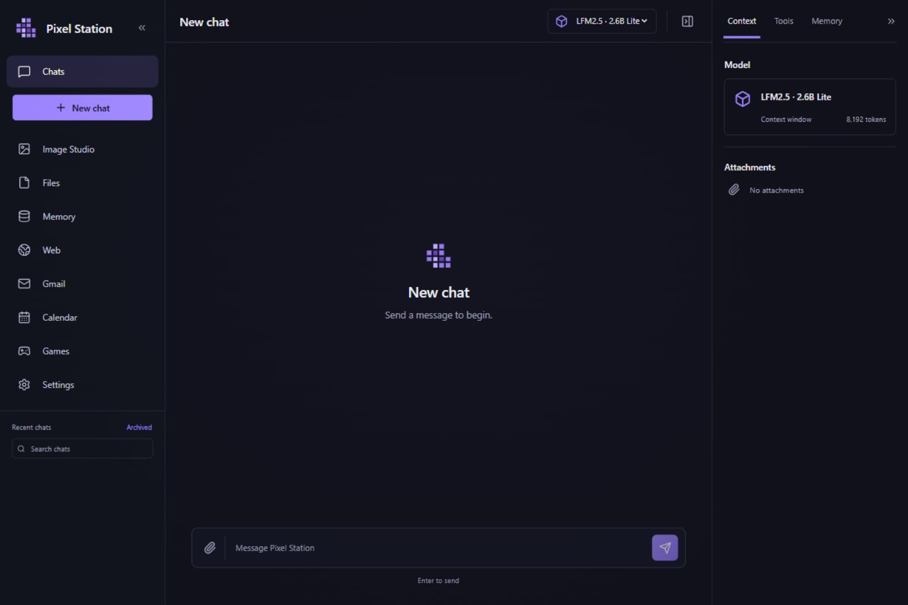

# Pixel Station

A personal AI workstation with local Ollama inference, a FastAPI backend and a custom React interface. Conversations, attachments, memories, generated files and images stay in the configured local data directory. Gmail, Google Calendar and web research use their respective online services. There is no commercial cloud LLM fallback.



## Run on Windows

Requirements: Windows 11, Git, Node.js 22.13 or newer (Node 24 LTS recommended), Ollama, an installed local chat model and sufficient space for Python/document dependencies. GPU inference requires a compatible current GPU driver. The launcher installs an isolated Python 3.12 environment and project dependencies; it does not alter your system Python.

```powershell
git clone https://github.com/marticampgin/PixelStation.git
cd PixelStation
.\start.ps1
```

You can also double-click `start.cmd`. First launch downloads dependencies. The app opens at **http://127.0.0.1:5173**, with the API on **http://127.0.0.1:8000**. Keep the launcher running; Ctrl+C stops the processes it started. If PowerShell blocks scripts, use `start.cmd`, which applies a process-local execution policy.

```powershell
.\start.ps1 -NoBrowser     # Start without opening a browser
.\start.ps1 -Check         # Run backend checks and frontend tests/build
```

The backend and frontend bind to loopback. Ports 8000 and 5173 must be free. The launcher will not stop an unrelated application occupying them. Runtime logs are under `data/logs`.

## Local models

Install [Ollama](https://ollama.com/download/windows), then start it. Settings discovers the actual installed models and lets you assign the primary chat, planner, router, summarizer, memory extractor, critic, vision and embedding roles. Roles may share one model; an embedding role needs an embedding-capable model, and visual questions need a vision-capable model.

```powershell
ollama pull LiquidAI/lfm2.5-2.6b
ollama pull qwen3-embedding:0.6b
```

The [official LiquidAI registry model](https://ollama.com/LiquidAI/lfm2.5-2.6b) includes Ollama's native LFM renderer and parser. Lite prefers its discovered installed name, including the `:latest` tag. Model names and capabilities are discovered rather than assumed. Settings provides recommended profiles:

| Profile | Chat | Embedding | Default context |
| --- | --- | --- | --- |
| Lite | `LiquidAI/lfm2.5-2.6b` | `qwen3-embedding:0.6b` | 8K |
| Balanced | `qwen3.5:4b` | `qwen3-embedding:0.6b` | 16K |
| Strong | `qwen3.5:9b-q4_K_M` | `qwen3-embedding:0.6b` | 16K |

Profiles configure roles and context; they do not silently download models. Optional Lite vision: `qwen3.5:2b`. Start with Lite on an 8 GB RAM machine. Image generation and large context windows compete with chat for memory. The launcher sets `OLLAMA_NO_CLOUD=1` when starting Ollama; the backend also rejects cloud inference and limits the Ollama endpoint to loopback.

If you already have the Hugging Face import `hf.co/LiquidAI/LFM2.5-2.6B-GGUF:Q4_K_M`, its embedded template can force thinking even when disabled. On the development machine this exhausted structured-output budgets. The included [Modelfile](config/ollama-lite.Modelfile) provides an optional alias reusing the existing weight blob:

```powershell
ollama create pixel-station-lfm2.5:2.6b -f config/ollama-lite.Modelfile
```

Prefer the official registry model for chat and structured roles. A live follow-up after CSV creation exposed incorrect historical-task continuation with the earlier alias template; the official model answered the new planning request correctly. The alias now uses the same native renderer/parser rather than a handwritten chat template; real schema-constrained CSV output was verified on Ollama 0.32.14. Recreate any existing alias after Modelfile changes. The original import remains available.

## Workspaces

- **Chats:** persistent conversations, streaming replies, search, rename, archive/delete, attachment input, message feedback and copy/regeneration actions. Chats and Games expand independently; chat rows reveal a confirmed-delete control on hover or keyboard focus.
- **Files:** local uploads, parsed sections, file questions and deterministic TXT, Markdown, CSV, XLSX, DOCX and PDF generation. Reviewed edits require confirmation and preserve the previous version. Original uploads are deduplicated by content hash. The paperclip is the chat attachment control.
- **Memory:** explicit and extracted memories, search, categories, pinning, edits, revisions and source provenance. Automatic candidates must cite an actual user message from the summarized batch; uncited candidates are skipped. Conversation summaries keep older turns out of the immediate context window. Retrieval remains useful through lexical search when embeddings are unavailable.
- **Web:** configured SearXNG searches and bounded research with actual retrieved sources. HTTP fetching rejects non-public network targets and enforces resource limits.
- **Image Studio:** direct ComfyUI workflows, prompt/seed/dimension controls, real generation jobs and a persistent image library. Image prompts are not rewritten automatically by a chat model.
- **Gmail / Calendar:** official Google API connectors, after personal OAuth setup. Email sending and Calendar changes require application-enforced confirmation. Explicitly requested Gmail draft creation is reversible and verified through the API.
- **Games:** 2–6 seat no-limit Texas Hold'em with distinct fox portraits, a highlighted current actor, adjustable action pacing and chip movement. Each opponent action and street reveal is saved before the next is requested; the timestamped log records paid chips and pot changes. Deterministic dealing, betting, hand evaluation and side pots protect chip accounting; AI players receive only their own cards and public information. Invalid or unavailable model actions use a surfaced legal fallback. Leaving pauses the next move; returning resumes the saved actor.
- **Settings:** local models, provider endpoints, memory/context limits and data management. The local [watchtower](docs/EVALUATIONS.md) records measured outcomes, latency, native usage and known repairs/fallbacks; active versioned gates and manual native probes remain separate from passive statistics. Diagnostic JSON downloads exclude private content by default. Six research steps and four memories are conservative initial limits, not empirically tuned optima.

Optional integrations show their real setup or connection errors until configured. They never fabricate search results, email, calendar entries or images.

## Integrations

See [the integration guide](docs/INTEGRATIONS.md) for SearXNG, ComfyUI workflows and Google OAuth setup. Configuration examples are in `config/`.

SearXNG is the default free search provider. Its documented container setup requires Docker Desktop/WSL 2 on Windows. ComfyUI is a separate native local service; its portable distribution includes its Python runtime. Image models are independent of chat models. A complete SD-Turbo FP16 example starts at 512 pixels and one sampling step; SDXL-Lightning and larger FLUX workflows have different memory needs. After installing the portable runtime, `./start-comfyui.ps1` starts it locally. No image weights are bundled or downloaded automatically. See [setup and model guidance](docs/INTEGRATIONS.md#comfyui-on-windows).

Google requires a Cloud project, enabled Gmail/Calendar APIs and a **Desktop App** OAuth client. Import the downloaded credentials through Settings, then complete your Google login and consent. An External OAuth application left in Testing can have refresh tokens expire after seven days for these scopes. The integration guide explains the personal-use production configuration and unverified-app behavior. OAuth tokens and credentials are never source-controlled.

## Data and privacy

Default data location: `<repository>/data`. Set `PIXEL_STATION_DATA` before launching to use another directory:

```powershell
$env:PIXEL_STATION_DATA = 'C:\Users\you\PixelStationData'
.\start.ps1
```

The primary SQLite database uses WAL, foreign keys and Alembic migrations. Files are stored under hash-addressed folders with originals, parsing metadata and parsed content. Other runtime folders hold generated outputs, images, integration state, logs and backups. OAuth refresh tokens use the operating-system keyring. Runtime data and secrets are excluded from Git.

Backups include private conversations and files: store them as private data. The application does not collect telemetry or retain model chain-of-thought. Model/runtime packages may download open-source parsing weights when first needed; document processing then happens locally. Ordinary email content is not automatically turned into general long-term memory.

Export snapshots the primary and nested SQLite databases and copies managed files, images, workflows and pending edit replacements. Credentials, keyring tokens, logs and caches are excluded. To restore, stop the app and extract the archive into the **same configured data directory**; managed file records currently contain absolute paths. Google authorization must be configured separately. There is no in-app restore or automatic path relocation.

## Development

```powershell
# After start.ps1 has installed the environment:
.\.venv\Scripts\python.exe -m pytest backend/tests -q
.\.venv\Scripts\python.exe -m ruff check backend scripts
.\.venv\Scripts\python.exe -m mypy --ignore-missing-imports --check-untyped-defs backend/pixel_station
cd frontend
npm run build
npm test
npm run lint
```

Tests use isolated temporary data and mocked external providers. Normal application code uses real integrations. The Windows launcher installs the hashed `backend/requirements.lock`, including optional Docling dependencies; CI uses the smaller hashed `backend/requirements-ci.lock` for core, development and vector dependencies. See [architecture](docs/ARCHITECTURE.md), [design system](docs/design/DESIGN_SYSTEM.md) and [implementation status](IMPLEMENTATION_STATUS.md). API documentation is available at `http://127.0.0.1:8000/docs` while running.

## Extending the application

- Add a **provider** behind the protocols in `backend/pixel_station/providers`; keep endpoint/model-specific behavior out of orchestration.
- Register a **tool** with an input schema, permission class, timeout and provider requirement. Expose only relevant tools for a routed task. External/destructive actions need application approval, irrespective of what a model asks for.
- Add a **parser or writer** behind the file interfaces, with content/size/path checks and deterministic output validation.
- Add a **game** with deterministic rules and a validated strategy boundary. Register and display it only when it is implemented.
- A future **MCP adapter** can translate MCP schemas into registry tools; it must preserve permissions and timeouts.

The harness clusters local friction events into maintenance findings and regression candidates. It diagnoses; it does not silently modify source. Native packaging, arbitrary code execution and automatic patch merging are outside the current default application.

## Troubleshooting

- **Ollama unavailable:** start Ollama and check `http://127.0.0.1:11434/api/tags`. Select an installed completion-capable model in Settings.
- **Slow replies / out of memory:** select Lite, reduce context and close resource-heavy applications. Load image generation separately from chat. Check the NVIDIA driver and `ollama ps` for actual GPU usage.
- **Scanned document has no text:** inspect its parsing status. Docling/OCR model downloads may be needed on first use; image understanding needs a configured vision model.
- **Web/image setup state:** start the configured SearXNG/ComfyUI service and test it from Settings. The app will not substitute a cloud provider.
- **Google authorization expires:** check the OAuth application's Testing/production status, scopes and consent; reconnect through Settings.
- **Startup failure:** inspect `data/logs`, check the two ports and run `start.ps1 -Check`.
