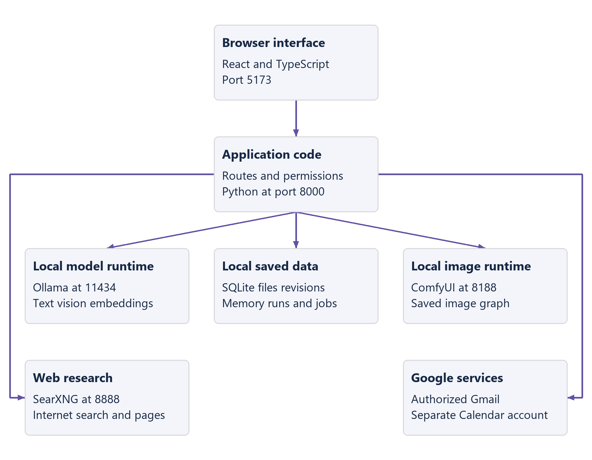
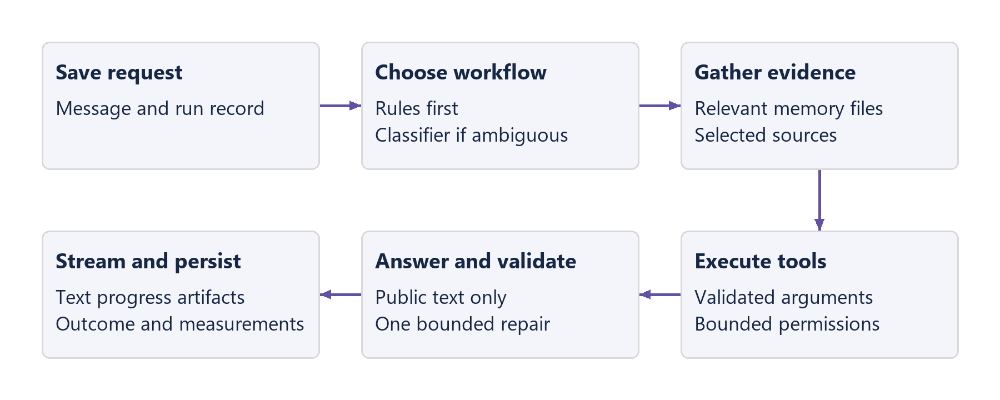
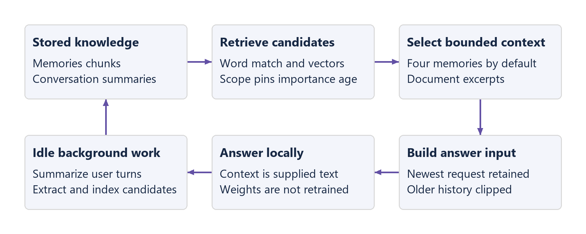
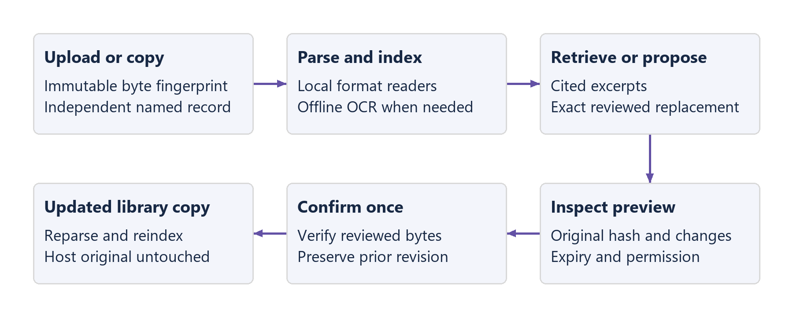
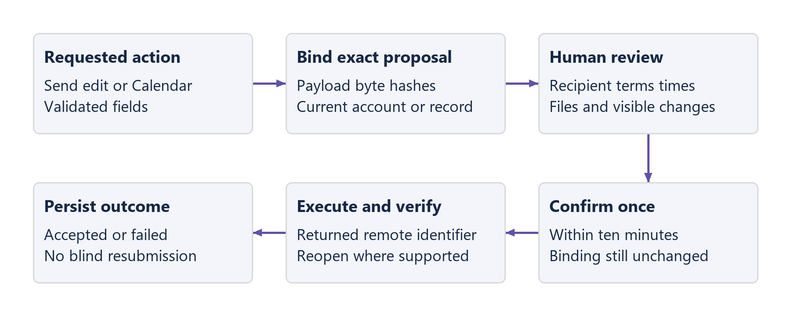
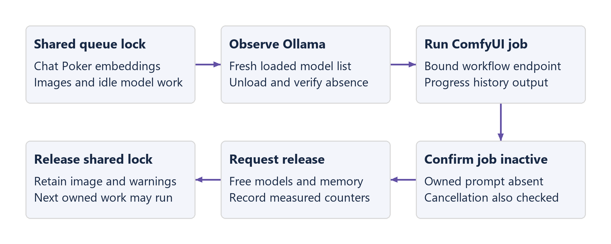
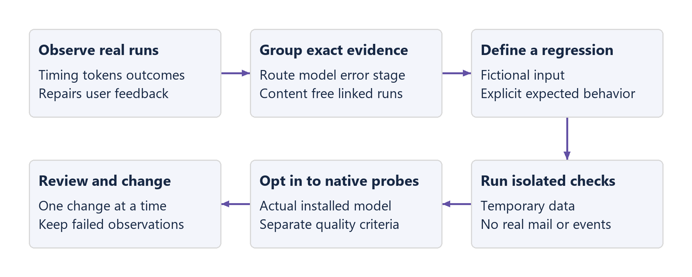

# Know Your Pixel Station

## What this guide explains

Pixel Station is a personal application running on your computer. You type or choose an action in its interface. Python code decides which workflow to run, retrieves relevant information, calls local models or configured services, checks their results, and saves the outcome. The language model supplies bounded judgments and wording; the application controls permissions, identifiers, deadlines, budgets and persistence.

This guide explains that full path, the components involved, the actual settings on this installation, and the limits that matter when you use or change it. It includes concrete requests and their execution paths. The reference appendix lists the configurable settings, operational limits, tool interfaces, stored records and model instructions. A machine-readable inventory accompanies it for exact source references.

An operation can finish successfully without its answer being correct. A saved image can contain a visual defect. A legal Poker move can be strategically poor. A cited page can be outdated. The watchtower therefore keeps execution outcomes, deterministic checks and model-quality observations separate.

## 1 The application at a glance

The browser interface runs at `http://127.0.0.1:5173`. That address means this computer. Its requests go to the Python application at port 8000 through the frontend's `/api` proxy. Ollama serves the installed language and embedding models at port 11434. ComfyUI serves image workflows at port 8188 when you start it. SearXNG serves Web searches at port 8888 through Docker.

Ordinary chat, memory retrieval, document processing, image inference and Poker decisions use local processing. Web research sends search terms to configured search engines and fetches public pages. Gmail and Calendar send their requested operations to Google. Model downloads and initial dependency installation also require the internet. There is no commercial cloud language-model fallback and no telemetry service receiving the watchtower's reports.

| Component | What it does | Why it is here |
| --- | --- | --- |
| React and TypeScript | Render chat, Files, Memory, Web, Gmail, Calendar, Image Studio, Poker and Settings. TypeScript checks expected data shapes before a build. | Interactive views share persistent application state; type checks catch mismatched frontend/backend fields. |
| Vite | Runs the local development interface and builds its static files. | A small, direct frontend build path with a local backend proxy. |
| FastAPI and Pydantic | Receive HTTP requests and validate their declared fields and limits. | Reject malformed requests before providers or model judgments can act on them. |
| SQLAlchemy and Alembic | Map Python records to database tables and apply numbered database changes. | Keep persistence explicit and make schema changes repeatable. |
| SQLite | Holds conversations, settings, memory, file references, runs and jobs in local files. | A personal installation does not need a separate database server. |
| SQLite full text search and sqlite-vec | Find matching words and semantically related records. | Combine exact terms with meaning-based retrieval while keeping the data local. |
| Ollama | Loads installed model weights and performs local generation and embeddings. | One replaceable inference adapter, native streaming and structured outputs. |
| ComfyUI | Executes a saved image-generation graph. | Image models and processing steps can change without rewriting chat or Image Studio. |
| SearXNG | Collects results from configured search engines. | The application uses one local search interface while engines remain replaceable. |
| Local document libraries and RapidOCR | Read Office/PDF/text files and recognize text in images or scanned pages. | Format-specific parsers preserve useful structure; text recognition is available without uploading documents. |
| Google connector and operating-system credential store | Access the separately authorized Gmail and Calendar services. | Account consent and token storage stay explicit, with independent service identities. |

A provider is a small interface between application code and a particular service. For example, `SearchProvider.search` returns search results without making the orchestrator depend on SearXNG's internal implementation. Changing a provider still requires implementation and testing; it is not accomplished by entering an arbitrary URL.

## 2 What happens after you press Send

The application saves the user message, marks the assistant response as generating, and creates a run record. It tries deterministic routing first: known slash commands, explicit Web/image/file requests and selected attachments provide strong intent signals. An ambiguous request can use the configured router model to return a small structured classification. A classification selects a supported workflow; it does not grant permission to execute arbitrary tools.

It then gathers relevant memories, attachment chunks and selected source evidence. It builds a bounded answer context, preserving the newest user request before adding older history. Tools run outside the final answer generation call. During that answer call, the model is told that tools are unavailable and that supplied material has already been read.

The frontend receives newline-separated JSON events. These carry progress, public text, resets, file/image results, approval proposals and completion state. A reset removes rejected partial text before the single permitted answer repair. Cancel requests stop the current run. Leaving a chat or starting another chat prevents late creation, loading or stream events from taking over the new view.

### A normal chat request

Request: “Explain how a SQLite database is backed up in this application.” The ordinary answer route gathers relevant context, uses the primary chat model, streams public text and persists the answer. It does not automatically search the internet or run a shell command. An answer about the code is only as reliable as the source evidence supplied to that request; the model does not inspect the repository implicitly.

### A file question

Request: “Using the attached agreement, copy the signature date and complete rental date range exactly.” The application identifies the attached library record, reads its indexed excerpts and preserves their locations. Exact-date requests have an evidence-copy path so a complete range and its qualifiers are not shortened by a small model. Ordinary explanations and summaries still use the model. Multiple date-bearing source lines are presented with their locations rather than silently declaring one to be the only valid date.

### A Web research request

Request: “Research the official SearXNG setup instructions and give two facts with source links.” The model chooses bounded queries. Python builds and validates the search/fetch dependencies. Searches can run concurrently; each dependent fetch takes its URL from an actual search result. The answer receives a bounded source package. Displayed source links and Markdown citation checks require observed URLs, but they do not prove that a statement is supported by a page or remains current.

## 3 The models and the selected settings

The saved profile is Lite, suitable for this RTX 3060 Laptop GPU with 6 GB of graphics memory and 8 GB of system memory. The installed LiquidAI LFM2.5 2.6B registry model is assigned to primary chat, routing, planning, summarization, memory extraction and the optional critic. Assigning a critic model does not enable the critic; that switch is currently off. Qwen3.5 2B is assigned to image understanding. Qwen3 embedding 0.6B produces retrieval vectors.

“2.6B” describes about 2.6 billion learned model parameters, not the number of tools or words it can reliably handle. Quantization stores model weights with fewer bits, reducing memory use at some possible quality cost. A model's theoretical context length is also different from the smaller context configured for this application.

| Setting | Saved value | What that means |
| --- | --- | --- |
| Context window | 8192 tokens | Total model context target, including input and generated output. A token is a model text unit, often part of a word. |
| Maximum answer | 2048 tokens | Upper generation limit, not a requested minimum length. |
| Retrieved memories | 4 | At most four memory records are selected for chat retrieval. Their text also has a separate context allowance. |
| Tool steps | 6 | Shared limit for bounded research/selected-source/adaptive tool work, not every model call or every integration operation. |
| Summary threshold | 6 turns | Eligible conversations can be compacted by idle background work after enough new conversation turns. |
| Thinking | Off | Sends the switch only when the discovered model supports it. Hidden reasoning is discarded regardless. |
| Critic | Off | Avoids the extra validation-model pass unless you enable it. |
| Automatic memory | On | Allows eligible structured memory candidates from user messages to be stored during background summarization. |
| Model warmth | 5 minutes | Keeps the primary model loaded between requests when possible. Lite sidecar calls use a shorter residency policy. |
| Application time zone | Europe/Riga | Used for chat Calendar date interpretation. The manual Calendar editor currently uses the browser's local zone. |
| Passive watchtower | Daily, last 7 days, up to 1000 samples | Computes local observations; it never schedules native model evaluations automatically. |

These are conservative starting values, not proven optimums for every task. Six tool steps allow a few searches and fetched pages without an open-ended loop. Four memories limit irrelevant competition for context. The 8K context and one loaded model reduce pressure on this machine. The native measurements in the evaluation report are the evidence for changing them; a passing isolated test alone is not a performance benchmark.

Balanced and Strong presets are role/context assignments, not automatic downloads or verified hardware recommendations for this installation. Missing models remain missing until installed. The model selector distinguishes the official registry model, the Hugging Face import and the optional local alias by label and exact identifier. Similar names can represent separate Ollama records even when they use related weights.

## 4 Context and memory

The answer context contains instructions, a conversation summary, a few retrieved memories, active document excerpts, tool evidence and recent messages. It is not the entire database. The application estimates token use as approximately one token per four characters; this is a budgeting approximation, not the model's measured tokenizer count.

With 8192 context tokens and a 2048-token answer limit, the input budget is 6144. The system instruction consumes part of that. At least half the remaining allowance is reserved for recent history, with a minimum of 512 tokens. Summary, memory, files and tools each have separate ceilings. Segments share the remaining space, so the listed maxima are not additive guarantees. Old messages can be dropped while their evolving summary remains available.

Memory has four practical layers. Recent messages are working context. A saved conversation summary preserves older discussion in shorter form. Event-like memories describe particular decisions or occurrences. More durable records store preferences, projects, workflows and facts. These layers all remain ordinary local records; the model is not retrained when a memory is added.

Retrieval combines word matches, vector similarity, importance, recency, scope and pins. A vector is a list of numbers representing text for similarity comparison. It is not a copy of the whole original document and does not prove truth. The installed embedding model has produced 1024-dimensional vectors in native checks; changing models can require reindexing existing records.

The memory score adds lexical rank, nonnegative vector similarity, 15 percent of importance, a 0.7 pin bonus, a 0.15 active-scope bonus and a small age-decaying recency bonus. Unpinned records without a word match or vector similarity above 0.15 are excluded. This is an application policy, not a scientifically calibrated confidence score. The UI shows recorded reasons such as pinned, lexical match or active scope.

Example: a stored preference says “Use short Norwegian replies for rental inquiries.” A later Gmail reply request can retrieve that communication-style memory. It should not derive a booking date, available room or price from that preference. The thread, selected approved template and explicit task values provide those facts.

Automatic extraction runs in idle work rather than after every trivial message. Candidates must come from actual user messages in the processed batch. Private integration evidence is excluded from general extraction. Exact normalized duplicates return the existing memory. Edits preserve prior text as revisions and clear stale vectors. Contradiction/update relationships can be recorded explicitly; there is no automatic comprehensive contradiction detector.

## 5 Files and reviewed changes

An upload is stored as an immutable content-addressed blob. The application computes a SHA-256 fingerprint: a long checksum used to recognize identical bytes and detect changes. File records keep their own name, parsing metadata and retrieval chunks. Independent named copies can share the same original bytes while retaining separate edit/revision history. Editing one copy does not change another record or the original file on your Desktop.

Text, Markdown and source files are read directly. Office files use local libraries and, when available, Docling normalization. PDFs first preserve native text. Blank/scanned pages and supported images use offline RapidOCR on the CPU. Native parsers retain locations such as page, sheet, slide, table paragraph, header or footer. Docling Office normalization exports whole-document Markdown with structural headings rather than promising all native coordinates. Chunking groups structural paragraphs and splits exceptionally large ones at word boundaries; it does not add automatic overlapping windows.

OCR means optical character recognition: converting visible letters in an image to text. Its result can contain character mistakes. Native checks recovered Latvian accents and Norwegian lowercase æ, ø and å, while some uppercase Norwegian characters were misread. Qwen image understanding can inspect an actual image alongside its OCR excerpt; those are two sources of evidence, not an independent guarantee of visual accuracy.

File creation supports TXT, Markdown, CSV, XLSX, DOCX and PDF. The writer creates real bytes, reopens/parses the result, then registers the artifact. A generated filename is preserved even when another artifact has identical content. Formula-like spreadsheet text is escaped in creation paths that treat content as data rather than trusted formulas.

Edits create a proposal rather than overwriting immediately. The review shows the plan, exact replacement or field changes, original fingerprint and preview. Confirmation is single-use and expires after ten minutes. It verifies that the original and replacement still match the reviewed bytes. The prior managed bytes become a revision, and retrieval/indexing is rebuilt for the updated record.

Targeted Word edits preserve the surrounding document structure, runs and formatting while replacing exact spans across split runs. They can reach existing table, header and footer text. Genuine Word checkbox controls have explicit boolean state. Drawn rectangles, ink ticks and embedded pictures are different objects; an arbitrary drawing cannot safely be interpreted as a checkbox. The owner-provided agreement uses those drawings, so its original graphics remain intact.

A separate fictional TEST copy now replaces four explicitly mapped drawing selections with genuine Word controls for rooms, sound, projector and cleaning. The application editor can review and toggle those controls. This was a deliberate conversion of known template objects, with rendered checks, rather than automatic inference about arbitrary drawings. Both the original document and its original signature/media remain preserved.

Spreadsheet edits preserve unchanged cell types, formulas, styles and other worksheets. Typed changes are explicit rather than converting all values to text. PDF text replacement remains a disclosed rebuild path: it cannot promise preservation of arbitrary original layout, images or annotations. For a specific fixed-layout form, a separate field-aware implementation and render verification would be needed.

Example: make an independent agreement copy, propose fictional dates in 2099 and a different selected package, inspect the preview, then confirm. A stale proposal from before a later edit cannot be applied to the changed record. Before using a real client contract, inspect the actual rendered document and its graphical selections; passing text or XML checks cannot prove correct page wrapping.

For a narrowly phrased request to copy numeric dates exactly, the application reads date-bearing indexed chunks in source order, independently of the normal relevance ranking. It scans at most 1,000 candidate chunks and 200,000 characters, then returns up to eight cited excerpts without model rewriting. It retains complete recognized ranges and nearby wording, discloses scan/output limits and incomplete indexes, and avoids assigning an unlabeled date to a field. This covers supported numeric date patterns in indexed text; it does not interpret every date format or recover unindexed drawings.

## 6 Tools and bounded execution

The tool registry describes each supported action, its input schema, permission class, timeout and provider. A schema is the declared set of fields and allowed values. Python validates those fields before execution. Normal answer generation does not expose the whole registry to the model.

There are three workflow levels. Simple chat uses an answer call. A tool-assisted request performs a direct supported operation and synthesizes its result. Complex Web research uses a directed dependency graph: each step runs after its prerequisites, and independent steps can run in parallel. The graph is application-owned rather than an unrestricted conversation between several models.

Some requests need observation-driven execution. Explicit `/task` or `/agent` requests and supported complex routes expose up to four relevant tools. The model chooses only a tool plus arguments, or finish. The controller executes a real tool and returns a bounded observation. Actual search results authorize URLs; actual Gmail results authorize thread identifiers; active attachment records authorize file retrieval. The model cannot make an invented identifier valid by placing it in JSON.

Adaptive work shares the configured step allowance with selected-source reads. Its overall deadline is 180 seconds, including queue waits; one model decision has a 45-second ceiling and 768-token output limit. One malformed-action repair is permitted. Identical normalized actions stop further execution. The application preserves already gathered evidence for a bounded answer and reports the stop; required artifacts remain explicitly incomplete if they were not created. A stopped or partial workflow is not graded as successful task judgment merely because text was returned.

Example: search for official documentation, fetch the observed result, then answer from that page. If the small model selects the same fetch again, the application does not fetch endlessly. It retains the first result and records the repeated-action limit. The final answer can use that evidence while visibly acknowledging the stop.

## 7 Gmail and Calendar

Gmail and Calendar share a downloaded Desktop application client configuration, but authorization, tokens, account identities and pending states are separate. You can use one Google account for Gmail and another for Calendar. Gmail is connected on this installation. Calendar remains disconnected until its intended account can grant consent.

Gmail requests read-only mailbox access plus compose/draft/send access. It does not request the full-mailbox scope that also permits permanent deletion. Gmail search returns real thread identifiers; reading retrieves the messages and MIME parts. MIME is the email format that separates headers, body and attachments. Download/import validates the actual selected part and bounded decoded bytes.

Reply generation uses the selected thread, relevant communication-style memory and explicitly approved template wording. Saving or editing a template does not approve it. Approval fingerprints the exact displayed name, text and keywords; an edit revokes it. Templates guide phrasing but do not authorize facts, commitments or sends.

Draft creation is a separately requested action and verifies the returned draft identifier. Sending returns a concrete review card. Its exact recipient, subject, body, account binding and attachment names/sizes/checksums are immutable for that proposal. Composer changes discard the prior review. Attachment snapshots prevent a later library edit from changing what was approved. Confirming consumes the review once and checks the current connection.

Three authorized test messages verified a plain body, synthetic image and fictional edited Word attachment in Google's returned Sent copies. That verifies the saved send result; it does not independently inspect the recipient's inbox. Creating a draft and separately sending its composed content leaves the saved draft in place.

Calendar reads a selected interval and proposes event create/update/delete operations. Timed event values require explicit offsets; all-day events use dates with an exclusive end date. Updates and deletes capture the existing event version so a concurrent remote edit requires a new review. The manual editor checks overlaps among its currently loaded two-week agenda, not every possible calendar event. Invitations and recurrence are outside that editor's current scope.

If Google accepts a mutation but verification fails, the returned identifier and accepted state remain visible. Inspect that remote result before proposing it again. A consumed confirmation does not become reusable just because follow-up verification was unavailable. Refreshing credentials normally preserves connection identity; disconnecting/reconnecting or changing the client invalidates earlier reviews.

## 8 Image generation and resource sharing

Image Studio passes the entered positive prompt directly to ComfyUI. It does not use a language model to rewrite the prompt. A saved API-format graph specifies checkpoint loading, text encoding, image dimensions, sampling, decoding and saving. Binding fields identify which graph inputs Pixel Station may replace for prompt, seed, width and height.

The saved default is SDXL Base at 1024 by 1024 pixels and 28 sampling steps. DreamShaper 8 at 512 by 512 and SD-Turbo at 512 by 512 remain available. The appendix records each graph's guidance strength, sampler, scheduler, negative prompt and seed policy. A seed initializes the random generation; keeping it and the graph fixed aids comparison, although changing software/hardware can still affect exact reproducibility.

SDXL produced stronger adherence than the lighter profile in the checked examples, but it was slower and caused heavy system-memory paging on this 8 GB machine. Native SDXL executions took about 50 and 126 seconds in two different requests; these are samples, not a promised duration. The quality-first default reflects your preference, not a claim that SDXL always fits comfortably.

Pixel Station uses one shared inference lock for its model work, embeddings, Poker and image generation. Before an image job starts, it observes Ollama's resident models, requests their unload without sending a text prompt, and confirms absence. After the owned ComfyUI job becomes inactive and its queue is clear, it requests model/memory release and records acknowledgement separately from measured residency changes. Other applications using these services can still compete for memory.

The job holds the endpoint selected at submission; a later Settings change cannot redirect polling or cancellation. Cancellation targets that job's known remote prompt and confirms its disappearance where possible. If cleanup cannot be confirmed, the persisted state says it may still be running. Restart marks interrupted jobs rather than silently retrying them. A completed image remains available even if release verification produces a warning.

## 9 Poker

Poker is a deterministic two-to-six-seat no-limit Hold'em engine. Python deals cards, enforces legal actions, moves chips, handles all-ins and side pots, evaluates hands and persists state. The model chooses an action within the legal state; it does not deal the deck or decide the winner.

Each opponent sees its own hole cards, the public board, position, pot, stack depth, price to call and recent public actions. It does not see other hole cards, the deck or future cards. The application derives hand-strength tiers and a 128-sample estimate of its pot share against random unseen opponents/runouts. That estimate is noisy and does not model the opponents' actual hand ranges, fold equity, rake or side-pot eligibility.

Small stylistic differences provide bounded nudges. Legality and a separate risk policy reject moves such as inappropriate deep-stack weak-hand jams. A rejected or unavailable model result gets one repair within a 15-second whole-decision ceiling, then a disclosed legal fallback. The public response stores finite decision labels, not a private reasoning narrative.

The frontend advances one opponent action or street reveal at a time. Adjustable reading pace, actor highlights, chip flights, card reveals and public timestamped logs help you follow the sequence. A valid action and conserved chips establish rules correctness; they do not establish strong Poker play. Previous native strategy probes still contain failed decisions, even though later complete hands avoided the original repeated preflop all-ins.

## 10 The watchtower and evaluation loop

The passive watchtower collects actual local run outcomes, timing, tool counts, schema repairs, fallbacks, native Ollama token counters and user problem feedback. Native counters are measured only when the provider returns them. Character-based token estimates are labeled separately. Reports group exact recorded kind, route, model, status and allowlisted failure evidence, with linked content-free run records.

Completion rate describes terminated workflows, not answer correctness. A friction count describes events, not necessarily separate failed requests. Latency samples mix cold model loads, warm runs, queue waits and routes, so a single percentile is not a model benchmark. The interface explains these limits rather than assigning one universal score.

Active evaluations run versioned fixtures in isolated temporary data. Their inputs and expected outcomes are explicit. Deterministic gates test routing, context, tool budgets, file naming, retrieval, reasoning filtering, Gmail formatting, citation URL identity, observation-based targets, exact date evidence, adaptive loop recovery, Calendar date-window/payload validation and Poker rules/risk context. The Calendar gate tests declared structured dates, not arbitrary natural-language interpretation. Native chat and Poker probes are separate manual opt-ins. No real email is sent by a fixture and no live Calendar account is required for that isolated validation check.

Native probes use production generation paths and preserve rejected attempts or repairs even when the eventual answer passes. Comparable runs must match runner/fixture/configuration/package identities and native checkpoint/runtime identity. Unknown model identity prevents a claimed matching baseline. A latency difference between two runs is not statistical significance.

Example: report “The answer omitted the rental range's end date.” The local run keeps its route/model and bounded feedback. An isolated regression uses a fictional range with an expected complete quotation. A native check tests the installed model/application path. A passing regression prevents that specific defect; it does not certify every future agreement.

Diagnostics omit prompts, responses, raw source bodies and private examples by default. Including bounded private details is an explicit export choice. Reports do not upload themselves or modify source code. Maintenance patch creation and automatic merging are not enabled features.

## 11 Storage restart backup and failure recovery

The configured data directory defaults to the repository's `data` directory and is excluded from Git. `PIXEL_STATION_DATA` can choose another directory at startup. The core database, file blobs, edit previews/revisions, image library/workflows, integration proposals and reviewed Gmail attachment snapshots live under it. OAuth tokens live in the operating-system credential store and are not part of a file backup.

Database writes use transactions and write-ahead logging: SQLite can keep recent committed changes in a separate journal until checkpointing. Backups use SQLite's backup API for database files, including nested image stores, rather than copying only the main file and losing journaled changes. Reviewed attachment snapshots are included; credential files are deliberately excluded. A backup contains private application data and should be handled accordingly.

Restart preserves saved conversations, settings, memory, file records, templates, Poker tables and image libraries. In-progress chat runs become interrupted; incomplete remote image cleanup remains explicit. Current documented restoration uses the same configured data directory while the application is stopped. There is no in-app arbitrary-path restore wizard or packaged desktop distribution yet.

The Windows launcher starts the backend and frontend and opens the application unless `--no-browser` is given. It refuses already occupied application ports and stops only processes it started. Ollama can be started if absent. SearXNG and ComfyUI remain optional external services with their own launch/setup paths. An unavailable provider produces a real error/setup state while unrelated features stay usable.

## 12 How to change settings deliberately

Choose a repeatable request before changing a limit. Save the current diagnostic configuration and identify the observed problem: missing evidence, invalid structured action, cold-load latency, memory pressure or bad factual judgment. Change one relevant value, rerun the same cases, and compare both correctness and resource use.

If four retrieved memories omit a known relevant fact, first inspect the retrieval reason and scope. Increasing the count cannot repair a missing index or incorrect memory. If the sixth tool step is exhausted, inspect whether the workflow needed that many distinct operations or repeated one. Increasing the maximum cannot fix a repeated-action defect. If the output stops at its token bound, raise the answer limit only within the machine's context/resource constraints.

If a draft invents booking terms, adding a stronger model may help, but the correct control remains explicit evidence and reviewed sends. If image quality is insufficient, compare checkpoint and sampling settings with fixed prompts/seeds; a larger resolution alone does not guarantee better anatomy or text. If Poker decisions are legal but poor, inspect strategy probes separately from rules tests.

Native Calendar verification remains pending its intended account. Arbitrary drawn checkmarks and PDF layout-preserving edits remain template-specific work; the four mapped selections in the separate TEST Word template are usable controls. Additional games, external tool adapters, sandboxed code execution and a native desktop wrapper are extension work. Their absence is explicit; no inactive production controls pretend that they work.

## Reference appendix

The following reference is generated from the reviewed source and sanitized installation snapshot. Each operational value is grouped with its purpose. Code names are retained so a future change can be found precisely; the surrounding descriptions define what they mean. Source references point into the repository, and the companion JSON retains the complete extracted declarations and policy expressions.

<!-- GENERATED_REFERENCE -->
